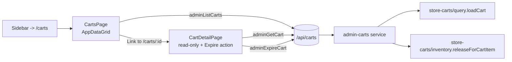

## Architecture overview



The new admin module reuses the storefront cart projection (`loadCart`) for the detail view and the existing reservation-release helper for expiry, so we don't reimplement compute / inventory logic.

## Open product decisions (locked in)
- "Invalidate/expire" = force-expire only: set `carts.expiresAt = now()` and release inventory reservations. The row stays for history.
- Row click = match existing pattern (first-cell `<Link>`), no `AppDataGrid` changes.

## Backend

### 1) Admin cart types - [packages/types/src/admin/cart.ts](packages/types/src/admin/cart.ts) (new) + re-export from [packages/types/src/admin/index.ts](packages/types/src/admin/index.ts)

```ts
export const adminCartListItem = z.object({
  id: z.string().uuid(),
  customerId: z.string().uuid().nullable(),
  customerEmail: z.string().nullable(),
  customerName: z.string().nullable(), // null = guest cart
  currencyCode: z.string(),
  itemCount: z.number().int().nonnegative(),
  subtotal: z.number().int().nonnegative(),
  total: z.number().int().nonnegative(),
  isExpired: z.boolean(),
  expiresAt: z.string(),
  createdAt: z.string(),
  updatedAt: z.string(),
});

// Detail re-uses the storefront StoreCart shape and adds admin-only fields:
export const adminCartDetail = adminCartListItem.extend({
  shippingAddress: customerAddress.nullable(),
  billingAddress: customerAddress.nullable(),
  items: z.array(storeCartItem),
  promotions: z.array(storeCartPromotion),
  totals: storeCartTotals,
});
```

### 2) New admin module - `apps/api/src/admin-carts/`

- `schema.ts` - `listCartsQuery` with: page/pageSize/search (by id, customer email/name), filters `status: 'active' | 'expired'` and `customerType: 'guest' | 'registered'`, `sortBy: createdAt | updatedAt | expiresAt | total`, `sortOrder`. Plus `cartIdParam`.
- `service.ts`:
  - `listCarts(query)` - single SQL with `LEFT JOIN customers`, aggregated `count(cart_items)` and a subquery sum of `cart_items.quantity * variant_price` for an approximate subtotal/total (or use a per-row call to `loadCart` only for the page being shown - simpler and accurate; pageSize cap = 50). Compute `isExpired = expiresAt <= now`.
  - `getCart(id)` - loads cart via existing `loadCart` from [apps/api/src/store-carts/query.ts](apps/api/src/store-carts/query.ts) and decorates with full shipping/billing address rows + customer summary + `isExpired`.
  - `expireCart(id)` - in a single `db.transaction`: list cart_items, call `releaseForCartItem(tx, item.id)` for each (already implemented in [apps/api/src/store-carts/inventory.ts](apps/api/src/store-carts/inventory.ts)), then `update carts set expiresAt = now where id = ?`.
- `controller.ts` - `listCartsController`, `getCartController`, `expireCartController`. Wraps with `ok(c, ...)` envelope.
- `routes.ts` - mounts behind `requireAdmin`:
  - `GET /` -> `adminListCarts`
  - `GET /:id` -> `adminGetCart`
  - `POST /:id/expire` -> `adminExpireCart` (returns the refreshed `adminCartDetail`)

### 3) Wire route in [apps/api/src/app.ts](apps/api/src/app.ts)

```ts
import { adminCartsRoutes } from "./admin-carts/routes";
// ...
app.route("/api/carts", adminCartsRoutes);
```

### 4) Regenerate OpenAPI + SDK

Run from repo root: `pnpm sdk:generate` (chains `openapi:emit` + admin/storefront SDK kubb gen). Produces typed `adminListCarts`, `adminGetCart`, `adminExpireCart`, `useAdminGetCart`, `adminListCartsQueryKey`, etc., consumed by the admin UI.

## Frontend (admin)

### 5) Hooks - `apps/admin/src/features/carts/hooks/index.ts`

Mirrors [apps/admin/src/features/orders/hooks/index.ts](apps/admin/src/features/orders/hooks/index.ts):

```ts
export const cartsQueryPrefix = adminListCartsQueryKey();
export function useCart(id: string) { /* useAdminGetCart */ }
export function useExpireCart(id: string) {
  // useMutation -> adminExpireCart, on success invalidate cartsQueryPrefix +
  // adminGetCartQueryKey(id), toast "Cart expired", optionally navigate to /carts.
}
```

### 6) Pages

- `apps/admin/src/pages/carts/CartsPage.tsx` - identical pattern to [apps/admin/src/pages/orders/OrdersPage.tsx](apps/admin/src/pages/orders/OrdersPage.tsx). Columns: Cart id (linked to `/carts/:id`) + customer name/email or "Guest", `Status` badge (Active/Expired), Items, Subtotal/Total (`formatMoney`), Created. Filters: `status` (active/expired), `customerType` (guest/registered). Initial sort `createdAt desc`. No "New cart" toolbar action (admin doesn't create carts).
- `apps/admin/src/pages/carts/CartDetailPage.tsx` - read-only summary panels:
  - Header with cart id, customer/email or Guest badge, Active/Expired status, "Expire cart" button (uses `Dialog`-based confirm; disabled if already expired).
  - Sections: Items table (sku, title, qty, unit price, line total), Promotions list, Addresses (shipping/billing), Totals breakdown (subtotal, discount, shipping, tax, total).

### 7) Routes - [apps/admin/src/App.tsx](apps/admin/src/App.tsx)

Add inside the protected `DashboardLayout` block:

```tsx
<Route path="/carts" element={<CartsPage />} />
<Route path="/carts/:id" element={<CartDetailPage />} />
```

### 8) Sidebar - [apps/admin/src/layouts/DashboardLayout/components/app-sidebar.tsx](apps/admin/src/layouts/DashboardLayout/components/app-sidebar.tsx)

Place "Carts" in the existing `sales` group, ordered by funnel: Carts -> Orders -> Customers. Use `IconShoppingCart` for Carts and switch Orders to `IconReceipt2` so the icons stay distinct:

```ts
{
  id: "sales",
  groupLabel: "Sales",
  items: [
    { title: "Carts", url: "/carts", icon: IconShoppingCart },
    { title: "Orders", url: "/orders", icon: IconReceipt2 },
    { title: "Customers", url: "/customers", icon: IconUsers },
  ],
}
```

## Notes / non-goals
- No bulk-expire or scheduled-expiry job in this change (carts already self-expire on TTL via the existing cleanup path).
- No edit of cart items / addresses from admin - the detail page is read-only aside from the Expire action.
- `assertCanMutate` in [apps/api/src/store-carts/service.ts](apps/api/src/store-carts/service.ts) is bypassed for admin because `requireAdmin` middleware already gates the route.