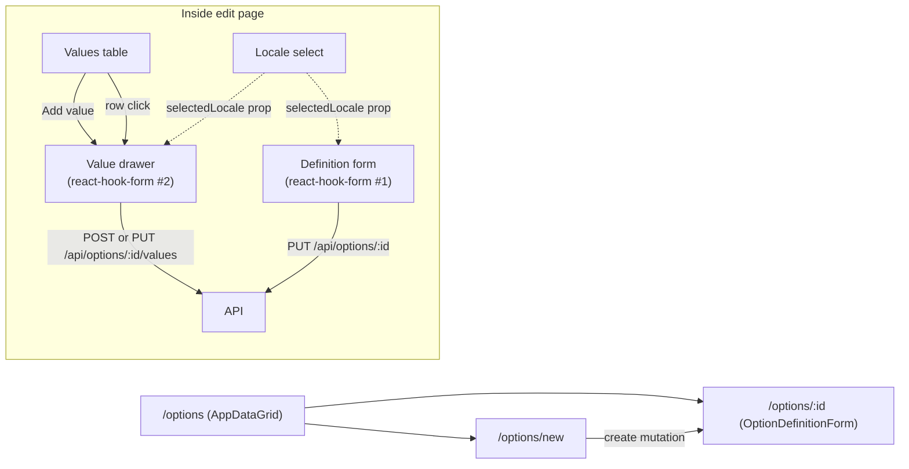

## Goal

Manage `option_definitions` and `option_values` translations (plus minor metadata like `code`) in a dedicated admin area. Mirrors the products feature in structure: zod schema → hooks (queries + form) → components (Form, cards, drawer) → pages.

Scope per the clarifications:
- **Nav:** new "Options" entry in main sidebar **Catalog** group, after Products/Categories.
- **Capabilities:** create + edit (translations + `code`); **no delete** in this UI to avoid breaking referenced products/variants. Existing catalog rows seeded by the product editor's option picker remain editable.

## Data model recap

Schemas already exist in [packages/database/src/schema/01-catalog.ts](packages/database/src/schema/01-catalog.ts):

- `optionDefinitions(id, code)` ⟂ `optionDefinitionTranslations(optionId, languageCode, name)`
- `optionValues(id, optionId, code)` ⟂ `optionValueTranslations(valueId, languageCode, label)`

Both junctions have unique-per-language indexes (`optionLangUnique`, `valueLangUnique`). No schema changes required.

## Backend (apps/api) — new `/api/options` module

Mirror the [tax-classes routes layout](apps/api/src/tax-classes/routes.ts) and the [products controller patterns](apps/api/src/products/controller.ts), reusing the helper `translatePgError` + `CONSTRAINT_MESSAGES` idea so duplicate `code` / `(optionId, code)` / `(optionId, languageCode)` / `(valueId, languageCode)` violations surface as friendly 409s.

New folder `apps/api/src/option-definitions/` with:

- **`routes.ts`** — `Hono` router mounted at `/api/options` in [apps/api/src/app.ts](apps/api/src/app.ts), `requireAdmin` on every route. Operation IDs follow the SDK naming convention (`adminListOptionDefinitions` is **already used** by the in-product picker — rename that controller's openapi `operationId` to `adminListProductOptionsCatalog` to free the slot, **or** keep it and use `adminListOptionDefinitions` here in a new `tags: ['option-definitions']` group; preferred: keep both, the existing one stays at `GET /api/products/options` and this new module owns `/api/options`).
  - `GET    /api/options` — paginated, search by code or translated name; query schema `listOptionDefinitionsQuery { page, pageSize, search?, languageCode?, sortBy: 'createdAt' | 'updatedAt' | 'code', sortOrder }`.
  - `POST   /api/options` — `{ code, translations: [{ languageCode, name }] }` (at least one translation in default language).
  - `GET    /api/options/:id` — full detail: definition + all translations + all values + each value's translations.
  - `PUT    /api/options/:id` — body `{ code?, translations? }`. Translations replaced as a set: insert new, update existing, delete missing — wrapped in a transaction.
  - `POST   /api/options/:id/values` — `{ code, translations: [{ languageCode, label }] }`.
  - `PUT    /api/options/:id/values/:valueId` — `{ code?, translations? }`, same upsert-set semantics.

- **`schema.ts`** — re-exports zod from `@repo/types/admin` (added below); local `optionDefinitionIdParam`, `optionValueIdParams`, `listOptionDefinitionsQuery`.

- **`service.ts`** — pure DB functions:
  - `listOptionCatalog(query)` — joins to a chosen-locale translation for the row's `name`, paginated like [products list](apps/api/src/products/service.ts#L249) (window count). Returns `{ data: OptionDefinitionListRow[], meta }`.
  - `getOptionDefinitionDetail(id)` — `db.query.optionDefinitions.findFirst` with `translations: true` and `values: { with: { translations: true }, orderBy: asc(optionValues.code) }`.
  - `createOptionDefinition(body)`, `updateOptionDefinition(id, body)` — both transactional; the update merges translations (insert/update/delete diff inside the txn to keep the unique `(optionId, languageCode)` constraint happy).
  - `createOptionValue(optionId, body)`, `updateOptionValue(optionId, valueId, body)` — same pattern; on update enforces `(optionId, code)` uniqueness via the existing `uk_option_values_option_code` index.

- **`controller.ts`** — thin wrappers using `parseBody` + `ok`, copying the `translatePgError` helper from products with a new `CONSTRAINT_MESSAGES` map (`uk_option_definitions_code`, `uk_option_values_option_code`, `uk_option_definition_translations_option_lang`, `uk_option_value_translations_value_lang`).

Mount the new routes in [apps/api/src/app.ts](apps/api/src/app.ts):

```ts
import { optionDefinitionsRoutes } from "./option-definitions/routes";
app.route("/api/options", optionDefinitionsRoutes);
```

## Shared types — `@repo/types/admin`

New file [packages/types/src/admin/option-definition.ts](packages/types/src/admin/option-definition.ts), exported from the admin barrel:

- `optionDefinitionTranslationInput` `{ languageCode, name }`
- `optionValueTranslationInput` `{ languageCode, label }`
- `createOptionDefinitionBody` `{ code, translations: [...] }` (min 1)
- `updateOptionDefinitionBody` `{ code?, translations? }`
- `createOptionValueBody` `{ code, translations: [...] }`
- `updateOptionValueBody` `{ code?, translations? }`
- `optionDefinitionListRow` `{ id, code, name, valuesCount, createdAt, updatedAt }`
- `optionDefinitionDetail` `{ id, code, createdAt, updatedAt, translations: [...], values: [optionValueDetail] }`
- `optionValueDetail` `{ id, optionId, code, createdAt, updatedAt, translations: [...] }`
- `listOptionDefinitionsQuery` (page/pageSize/search/languageCode/sortBy/sortOrder)

## SDK regeneration

After API ships, run `pnpm --filter @repo/admin-sdk generate` so kubb produces:

- `adminListOptionDefinitions` (paginated)
- `adminCreateOptionDefinition`
- `adminGetOptionDefinition`
- `adminUpdateOptionDefinition`
- `adminCreateOptionValue`
- `adminUpdateOptionValue`

Plus matching `*QueryKey` exports used by hook invalidation.

## Admin UI

### Sidebar

Edit [apps/admin/src/layouts/DashboardLayout/components/app-sidebar.tsx](apps/admin/src/layouts/DashboardLayout/components/app-sidebar.tsx), add to the `catalog` group items: `{ title: "Options", url: "/options", icon: IconAdjustments }` (from `@tabler/icons-react`). Keep ordering Products → Categories → Options.

### Routes

Edit [apps/admin/src/App.tsx](apps/admin/src/App.tsx):

```tsx
<Route path="/options" element={<OptionDefinitionsPage />} />
<Route path="/options/new" element={<OptionDefinitionCreatePage />} />
<Route path="/options/:id" element={<OptionDefinitionEditPage />} />
```

### Pages — `apps/admin/src/pages/options/`

Three thin pages mirroring `apps/admin/src/pages/products/`:

- `OptionDefinitionsPage.tsx` — `AppDataGrid` (see [products listing pattern](apps/admin/src/pages/products/ProductsPage.tsx)). Columns: **Name** (link to `/options/:id`, falls back to `code`), **Code** (mono), **Values** count badge, **Updated**, **Created**. Toolbar action: `New option`.
- `OptionDefinitionCreatePage.tsx` — `<OptionDefinitionForm mode="create" />`.
- `OptionDefinitionEditPage.tsx` — fetches `useOptionDefinition(id)` and renders `<OptionDefinitionForm mode="edit" initialData={data} />` with the same loading/error skeletons as [ProductEditPage](apps/admin/src/pages/products/ProductEditPage.tsx).

### Feature folder — `apps/admin/src/features/option-definitions/`

```
schema.ts
hooks/
  index.ts                        # query + mutation hooks
  useOptionDefinitionForm.ts      # the orchestrator hook
  useOptionDefinitionLocales.ts   # extracted, like useProductLocales
components/
  OptionDefinitionForm.tsx
  OptionDefinitionGeneralCard.tsx
  OptionValuesTable.tsx
  OptionValueEditDrawer.tsx
  OptionValueGeneralCard.tsx
utils/
  translation-form.ts             # translation map helpers (definition + value variants)
```

#### `schema.ts` — local form schemas

Mirrors [products/schema.ts](apps/admin/src/features/products/schema.ts):

```ts
export const optionDefinitionTranslationFieldsSchema = z.object({
  name: z.string(),
});
export const optionDefinitionFormSchema = z.object({
  code: z.string().min(1, 'Code is required').max(128),
  translations: z.record(z.string(), optionDefinitionTranslationFieldsSchema),
});
export type OptionDefinitionFormValues = z.infer<typeof optionDefinitionFormSchema>;

export const optionValueTranslationFieldsSchema = z.object({
  label: z.string(),
});
export const optionValueFormSchema = z.object({
  code: z.string().min(1).max(128),
  translations: z.record(z.string(), optionValueTranslationFieldsSchema),
});
export type OptionValueFormValues = z.infer<typeof optionValueFormSchema>;
```

#### `hooks/index.ts` — queries + mutations

Mirrors [products/hooks/index.ts](apps/admin/src/features/products/hooks/index.ts):

- `useOptionDefinition(id)`, `useOptionDefinitionsCatalog()` (list helper)
- `useCreateOptionDefinition` → toast + navigate to `/options/:id`
- `useUpdateOptionDefinition(id)` → invalidate list + detail, toast
- `useCreateOptionValue(optionId)`, `useUpdateOptionValue(optionId)` — invalidate definition detail, toast

`optionDefinitionsQueryPrefix = adminListOptionDefinitionsQueryKey()` exported for the data grid.

#### `useOptionDefinitionLocales.ts`

Direct copy of [useProductLocales.ts](apps/admin/src/features/products/hooks/useProductLocales.ts) with input narrowed to `OptionDefinitionDetail | undefined` (fallback uses `data?.translations[0]?.languageCode`). Same return shape.

#### `useOptionDefinitionForm.ts`

Copies [useProductForm.ts](apps/admin/src/features/products/hooks/useProductForm.ts) structure but slimmer — there are no nested mutations like the product/default-variant pair. Responsibilities:

1. `useCreateOptionDefinition` / `useUpdateOptionDefinition(id)`.
2. `useOptionDefinitionLocales(initialData)` — same selectedLocale dropdown driver.
3. Build `defaultValues` from `initialData` (pre-fill all known translation buckets). Lazy-create empty bucket for `selectedLocale` if missing (same `useEffect` pattern as products).
4. `ensureActiveLocaleFilled` — requires `name.trim()` for the active locale; same error-setting pattern.
5. `submitCreate` / `submitEdit` — `submitEdit` only fires when `form.formState.isDirty`, then `form.reset(values)` on success.
6. `title = isCreateMode ? 'New option' : (defaultLocaleName || code || 'Untitled option')`.

Returns `{ form, onSubmit, canSave, isPending, languages, selectedLocale, setSelectedLocale, title, navigateBack, isEditMode, isCreateMode }`.

#### `useOptionValueForm.ts` (inside `hooks/`, used by drawer)

Same pattern but for a single value: build per-locale bucket, reset on `value` change (mirrors [useVariantForm.ts](apps/admin/src/features/products/hooks/useVariantForm.ts)). Returns the form instance. The drawer triggers create vs. update based on whether it received a `value` prop.

#### `utils/translation-form.ts`

Direct mirror of [products/utils/translation-form.ts](apps/admin/src/features/products/utils/translation-form.ts) but with two pairs:
- `emptyOptionDefinitionTranslation()`, `buildOptionDefinitionTranslationsMap()`, `collectOptionDefinitionTranslations()`
- `emptyOptionValueTranslation()`, `buildOptionValueTranslationsMap()`, `collectOptionValueTranslations()`

`collect*` filters empty rows so we never POST a blank translation, exactly like products.

#### Components

- **`OptionDefinitionForm.tsx`** — wraps `FormProvider` + `FormPageShell` + `FormContentLayout`. Header right side: **locale `Select`** identical to [ProductForm.tsx#L55](apps/admin/src/features/products/components/ProductForm.tsx#L55) (only rendered in edit mode). Body:
  - Main column: `<OptionDefinitionGeneralCard selectedLocale={...} />`, then in edit mode `<OptionValuesTable definition={initialData} selectedLocale={...} />`.
  - Sidebar: `<RecordTimestampsCard record={initialData} />` in edit mode (same as products).

- **`OptionDefinitionGeneralCard.tsx`** — copies [GeneralInfoCard.tsx](apps/admin/src/features/products/components/GeneralInfoCard.tsx) shape:
  - **Name (EN)** input bound to `translations.<selectedLocale>.name` — label uses `Field Label ({localeLabel})` exactly like the product form.
  - **Code** input bound to `code` (locale-independent, no parens). Auto-suggested from default-locale `name` on first edit using a `slugify` helper, but only when `code` is untouched and we're in `create` mode (in `edit` we leave it alone unless the user types).

- **`OptionValuesTable.tsx`** — modeled on [VariantsTable.tsx](apps/admin/src/features/products/components/VariantsTable.tsx). Card titled `Values (n)`. Columns: **Label** (resolves `value.translations[selectedLocale]?.label ?? value.translations[default]?.label ?? value.code`), **Code** (mono), **Updated**. Toolbar slot: `Add value` button → opens drawer with `value=null`. Row click → opens drawer with that value. Drawer-managed via local `useState` (selected value id + `mode: 'create' | 'edit'`).

- **`OptionValueEditDrawer.tsx`** — copies [VariantEditDrawer.tsx](apps/admin/src/features/products/components/VariantEditDrawer.tsx), reuses [SidePanelForm](apps/admin/src/components/side-panel-form.tsx). **Locale-aware**: the drawer reads `selectedLocale` from props (parent passes the current locale from the page). Body:
  - `<OptionValueGeneralCard selectedLocale={...} />` — label `Label ({localeLabel})` for `translations.<selectedLocale>.label`, plus a locale-independent `Code` field.
  - On submit: `useOptionValueForm` builds the body, then either `useCreateOptionValue` or `useUpdateOptionValue` mutation. Drawer closes on success and the page-level definition query auto-invalidates so the table refreshes.

### Locale switch behavior on the edit page

The page-level `selectedLocale` is the single source of truth. It drives:

1. The definition's `Name (XX)` label and value path.
2. The value table's displayed label resolution.
3. The currently open drawer's `Label (XX)` field — when the page locale changes while a drawer is open, the drawer's `useFormContext` consumes the new path and re-renders against the active bucket (same behavior as product general info card).

Definition translations and value translations are saved to **independent endpoints**, so changing the locale never silently saves anything. Each form (definition + value drawer) has its own `react-hook-form` instance with its own `isDirty` gate, exactly like the product / default-variant pair.

## Save flow summary



## Tests

Add a focused test under `apps/admin/src/features/option-definitions/__tests__/OptionDefinitionForm.test.tsx` modeled on the existing products test:

- Renders create mode with `Name (EN)` and `Code` fields.
- Locale switch reveals an empty `Name (FR)` bucket and back to EN preserves typed value.
- Save submits trimmed translations only (empty buckets dropped).
- Values table opens the drawer on row click and saves an updated label only for the active locale.

Backend tests under `apps/api/src/option-definitions/__tests__/`: list pagination/search, create with default language only, update merges translations as a set (verify removed locales are deleted), value upsert keeps `(optionId, code)` unique error path returning 409.

## Files at a glance

- New: [apps/api/src/option-definitions/{routes,controller,service,schema}.ts](apps/api/src/option-definitions/routes.ts)
- New: [packages/types/src/admin/option-definition.ts](packages/types/src/admin/option-definition.ts) + barrel update
- New: `apps/admin/src/features/option-definitions/**` (schema, hooks, components, utils, tests)
- New: `apps/admin/src/pages/options/{OptionDefinitionsPage,OptionDefinitionCreatePage,OptionDefinitionEditPage}.tsx`
- Modify: [apps/api/src/app.ts](apps/api/src/app.ts) (mount route)
- Modify: [apps/admin/src/App.tsx](apps/admin/src/App.tsx) (3 routes)
- Modify: [apps/admin/src/layouts/DashboardLayout/components/app-sidebar.tsx](apps/admin/src/layouts/DashboardLayout/components/app-sidebar.tsx) (1 nav item)
- Regenerate: `packages/admin-sdk/src/gen/**` via `pnpm --filter @repo/admin-sdk generate`