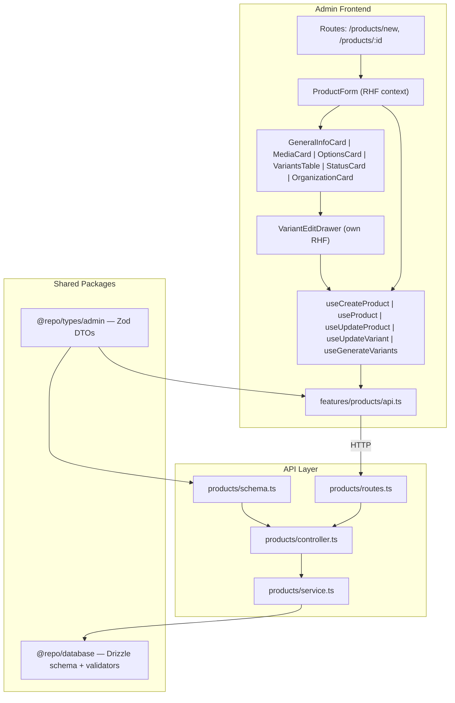

# Product CRUD Implementation Plan

## Architecture Overview



## Phase 1: Shared Types & Validation Schemas

**File:** [packages/types/src/admin/product.ts](packages/types/src/admin/product.ts)

The existing file has thin `createProductBody` / `updateProductBody` from raw DB validators. Replace with rich, nested Zod schemas that model the full create/update payloads including translations, options, option values, prices, and variant generation.

Schemas to define:

- `createProductBody` -- nested: `translations[]`, `options[].translations[] + values[].translations[]`, `variants[].prices[] + optionValueIndices[]`, `categoryIds[]`
- `updateProductBody` -- product-level fields only (name, description, status, categories, baseSku, taxClassId)
- `updateVariantBody` -- single variant: sku, weight, barcode, status, `prices[]` upsert
- `generateVariantsBody` -- defaults for price/weight to apply to new variants
- `ProductDetailResponse` -- full product with nested options, variants, translations, prices for GET `/api/products/:id`

Key: leverage existing `productsInsert`, `productVariantsInsert`, `pricesInsert` from `@repo/database/validators` via `.pick()` / `.extend()` to stay DRY.

## Phase 2: API Layer (Hono)

Follow the established pattern: `routes.ts` -> `controller.ts` -> `service.ts` with `schema.ts` for Zod validation.

### 2a. Schemas -- [apps/api/src/products/schema.ts](apps/api/src/products/schema.ts)

Extend with:
- Import and re-export the `@repo/types/admin` Zod schemas for request body validation
- Add `getProductParams` (`:id` uuid validation)
- Add `ProductDetailRow` response interface (the shape returned by the GET detail query)

### 2b. Routes -- [apps/api/src/products/routes.ts](apps/api/src/products/routes.ts)

Add to the existing `productsRoutes` Hono instance:

```typescript
productsRoutes.get('/',  listProductsController);           // existing
productsRoutes.post('/', createProductController);           // new
productsRoutes.get('/:id', getProductController);            // new
productsRoutes.put('/:id', updateProductController);         // new
productsRoutes.delete('/:id', deleteProductController);      // new (soft-delete)
productsRoutes.patch('/:id/variants/:variantId', updateVariantController);  // new
productsRoutes.post('/:id/variants/generate', generateVariantsController);  // new
```

### 2c. Controllers -- [apps/api/src/products/controller.ts](apps/api/src/products/controller.ts)

Each controller follows the existing pattern:
1. Parse/validate input (`parseBody` for POST/PUT/PATCH, `safeParse` for query/params)
2. Call service function
3. Return `ok(c, data)` or `ok(c, data, meta)`

Add `notFound` helper to [apps/api/src/lib/errors.ts](apps/api/src/lib/errors.ts):
```typescript
export const notFound = (message = 'Not found') =>
  new HttpError(ERROR_CODES.NOT_FOUND, message);
```

### 2d. Service Layer -- [apps/api/src/products/service.ts](apps/api/src/products/service.ts)

**`createProduct`** -- single `db.transaction()`:
1. Insert `products` row
2. Insert `productTranslations` (batch)
3. For each option: insert `productOptions` -> `productOptionTranslations` -> `productOptionValues` -> `productOptionValueTranslations`
4. For each variant: insert `priceSets` -> `prices` -> `inventoryItems` -> `productVariants` -> `variantOptionValues`
5. Insert `productCategories` (batch)
6. Return the created product ID

**`getProduct`** -- Drizzle relational query with nested `with`:
```typescript
db.query.products.findFirst({
  where: and(eq(products.id, id), ne(products.status, 'deleted')),
  with: {
    translations: true,
    options: { with: { translations: true, values: { with: { translations: true } } } },
    variants: { with: { optionValues: { with: { value: true } }, priceSet: { with: { prices: true } }, inventoryItem: { with: { levels: true } }, media: { with: { media: true } } } },
    media: { with: { media: true }, orderBy: ... },
    categories: { with: { category: { with: { translations: true } } } },
  },
})
```

**`updateProduct`** -- update only product-level fields + translations + categories in a transaction. Does NOT touch variants.

**`deleteProduct`** -- soft-delete: `update products set status = 'deleted'`.

**`updateVariant`** -- independent transaction:
1. Update `productVariants` row (sku, weight, barcode, status)
2. Upsert `prices` for the variant's `priceSetId` (delete removed currencies, insert/update existing)
3. Return updated variant

**`generateVariants`** -- compute cartesian product of current option values, diff against existing variants, create only new combinations:
1. Load existing `variantOptionValues` for product
2. Compute full cartesian set
3. Filter out combos that already exist
4. For each new combo: create `priceSet` -> `prices` -> `inventoryItem` -> `productVariant` -> `variantOptionValues`
5. Return count of created variants

## Phase 3: Admin Frontend

### 3a. New Routes in [apps/admin/src/App.tsx](apps/admin/src/App.tsx)

```typescript
<Route path="/products/new" element={<ProductCreatePage />} />
<Route path="/products/:id" element={<ProductEditPage />} />
```

Wire the "New product" button in `ProductsPage` to navigate to `/products/new`. Make product list rows clickable to navigate to `/products/:id`.

### 3b. Feature Module -- `apps/admin/src/features/products/`

**`api.ts`** -- add functions:
- `createProduct(body)` -- POST `/api/products`
- `getProduct(id)` -- GET `/api/products/:id`
- `updateProduct(id, body)` -- PUT `/api/products/:id`
- `deleteProduct(id)` -- DELETE `/api/products/:id`
- `updateVariant(productId, variantId, body)` -- PATCH `/api/products/:id/variants/:variantId`
- `generateVariants(productId, body)` -- POST `/api/products/:id/variants/generate`

Extend `productsKeys`:
```typescript
export const productsKeys = {
  all: ['products'] as const,
  list: () => [...productsKeys.all, 'list'] as const,
  detail: (id: string) => [...productsKeys.all, 'detail', id] as const,
};
```

**`hooks.ts`** -- TanStack Query hooks:
- `useProduct(id)` -- `useQuery` with `productsKeys.detail(id)`
- `useCreateProduct()` -- `useMutation` + invalidate `productsKeys.list()`
- `useUpdateProduct(id)` -- `useMutation` + invalidate `productsKeys.detail(id)`
- `useDeleteProduct()` -- `useMutation` + invalidate list, navigate to `/products`
- `useUpdateVariant(productId)` -- `useMutation` + invalidate `productsKeys.detail(productId)` (variant save is independent; only invalidates the detail cache, not the product form)
- `useGenerateVariants(productId)` -- `useMutation` + invalidate detail

**`schema.ts`** -- Client-side Zod schemas for the product form (friendlier messages than the server schemas). Split into:
- `productFormSchema` -- covers GeneralInfo + Status + Organization cards
- `variantFormSchema` -- covers the variant drawer fields

### 3c. New shadcn/ui Components Needed

Install via `pnpm dlx shadcn@latest add <name>` (from the admin app dir):

- **`dialog`** -- for confirmation modals (delete variant, remove option value)
- **`textarea`** -- for product description
- **`radio-group`** -- for status selection in sidebar
- **`scroll-area`** -- for the variant drawer content
- **`switch`** -- for tax inclusive toggle
- **`popover`** + **`command`** -- for category multi-select combobox (shadcn combobox pattern)
- **`alert-dialog`** -- for destructive confirmations (delete product)

Already available: `card`, `input`, `select`, `field`, `button`, `badge`, `sheet`, `table`, `tabs`, `checkbox`, `label`, `separator`, `skeleton`, `dropdown-menu`, `tooltip`, `drawer`.

### 3d. Page Components

**`apps/admin/src/pages/products/ProductCreatePage.tsx`**
- Renders `ProductForm` with `mode="create"`, no initial data
- On success: navigate to `/products/:newId` with toast

**`apps/admin/src/pages/products/ProductEditPage.tsx`**
- Reads `:id` from URL params, calls `useProduct(id)`
- Shows `Skeleton` while loading
- Renders `ProductForm` with `mode="edit"` and fetched data
- Also renders `VariantsTable` with server data (not part of the product form)

### 3e. Product Form Component Tree

```
features/products/components/
  ProductForm.tsx            -- FormProvider wrapper, sticky header bar, 2-column layout
  GeneralInfoCard.tsx        -- name, handle (auto-slug), description (textarea)
  MediaCard.tsx              -- placeholder for now (upload comes later)
  OptionsCard.tsx            -- dynamic option/value editing, generate button
  SimpleVariantCard.tsx      -- shown when options.length === 0 (inline SKU, price, stock)
  StatusCard.tsx             -- radio group: draft | published | archived
  OrganizationCard.tsx       -- tax class select, base SKU input, category multi-select
  VariantsTable.tsx          -- table of variants with bulk actions, row click opens drawer
  VariantEditDrawer.tsx      -- Sheet from right, own useForm, independent save
```

**`ProductForm.tsx`** -- the orchestrator:
- `useForm` with `zodResolver(productFormSchema)` for product-level fields
- `FormProvider` wrapping all card children
- Sticky top bar: product name (or "New product"), `[Discard]` button, `[Save]` button
- Two-column responsive layout: main content (2/3) and sidebar (1/3)
- On submit: calls `useCreateProduct` or `useUpdateProduct` depending on mode
- Shows toast via `sonner` on success/error

**`OptionsCard.tsx`** -- the critical dynamic section:
- Local state for options array (managed via `useFieldArray` or manual state since options are complex nested structures)
- Each option row: name input + tag-style value input (type and press Enter to add)
- "Add option" button (max 3)
- "Generate variants" button with preview count ("Will create N variants")
- Remove option/value with confirmation when variants exist

**`VariantEditDrawer.tsx`** -- independent form:
- Opens as a `Sheet` (already in ui/) from the right
- Own `useForm` with `zodResolver(variantFormSchema)`
- Fields: SKU, barcode, weight, status select
- Prices section: dynamic list of currency rows (code, amount, compareAt, taxInclusive)
- "Save variant" button calls `useUpdateVariant` -- no interaction with the parent product form

### 3f. Key UI Patterns

**Option value input** -- use a text input with tag-style chips. On Enter/comma, the current text becomes a chip. Each chip has an X to remove. This is a common pattern built from standard Radix primitives (`Input` + `Badge` + keyboard handler). No external dependency needed.

**Category multi-select** -- shadcn combobox pattern: `Popover` + `Command` (from cmdk via shadcn). Shows searchable dropdown with checkboxes. Selected categories appear as badges.

**Handle auto-generation** -- `useEffect` that slugifies the product name into the handle field, but only while the handle has not been manually edited (track with a `dirtyFields` check on RHF).

**Variant table inline editing** -- NOT inline editable in the table. Rows are clickable and open the drawer. Table shows read-only summary: option values, SKU, price, stock, status.

## Phase 4: Testing

### 4a. API Service Tests -- `apps/api/src/products/__tests__/`

Set up Vitest for the API app:
- Add `vitest` to `apps/api/devDependencies`
- Add `vitest.config.ts` mirroring the database package pattern
- Add `"test": "vitest run"` script to `apps/api/package.json`

**`service.test.ts`** -- integration tests using the `withTx` rollback pattern from `@repo/database`:
- `createProduct` -- verifies product + translations + options + variants + prices + categories are all created
- `createProduct` -- verifies SKU uniqueness constraint (conflict error)
- `getProduct` -- verifies full nested response shape
- `getProduct` -- verifies 404 on non-existent ID
- `updateProduct` -- verifies only product-level fields change, variants untouched
- `deleteProduct` -- verifies soft-delete (status = 'deleted'), product still in DB
- `updateVariant` -- verifies variant fields + prices update independently
- `generateVariants` -- verifies cartesian product math (2 options x 3 values = 6 variants)
- `generateVariants` -- verifies idempotency (running again creates 0 new variants)

### 4b. Admin Utility Tests -- `apps/admin/src/features/products/__tests__/`

Set up Vitest for the admin app:
- Add `vitest` + `@testing-library/react` + `@testing-library/jest-dom` to `apps/admin/devDependencies`
- Add `vitest.config.ts` with `environment: 'jsdom'`
- Add `"test": "vitest run"` script

**`variant-generator.test.ts`** -- pure unit tests:
- Cartesian product of 0 options = 1 empty combo
- Cartesian product of 1 option with 3 values = 3 combos
- Cartesian product of 2 options (2 x 3) = 6 combos
- Cartesian product of 3 options (2 x 3 x 2) = 12 combos
- SKU generation from baseSku + value labels

**`schema.test.ts`** -- Zod schema validation:
- Valid create payload passes
- Missing required fields fail with expected messages
- Invalid SKU format rejected

## Phase 5: Validation Checkpoints

Each checkpoint verifies the implementation is complete and working before proceeding:

**Checkpoint 1 (Types):** `pnpm type-check` passes across all packages. The new Zod schemas in `@repo/types/admin/product.ts` compile and infer correct TypeScript types.

**Checkpoint 2 (API compiles):** `pnpm --filter @app/api type-check` passes. All new routes, controllers, and services compile without errors.

**Checkpoint 3 (API tests green):** `pnpm --filter @app/api test` -- all service integration tests pass against the dev database.

**Checkpoint 4 (Admin compiles):** `pnpm --filter @app/admin type-check` passes. All new pages, components, hooks, and schemas compile.

**Checkpoint 5 (Admin tests green):** `pnpm --filter @app/admin test` -- variant generator and schema unit tests pass.

**Checkpoint 6 (E2E smoke):** Manual walkthrough:
- Navigate to `/products` -- list page loads
- Click "New product" -- create page renders with empty form
- Fill in name, description, SKU, select tax class, set status
- Save as simple product -- redirects to edit page, toast confirms
- Add options (Color: Red, Blue; Size: S, M, L) -- generate variants
- 6 variants appear in the table with auto-generated SKUs
- Click a variant row -- drawer opens, edit price, save variant -- toast confirms, drawer closes, table reflects update
- Change product name, save product -- toast confirms, only product fields updated
- Navigate back to list -- new product appears with correct name and status
