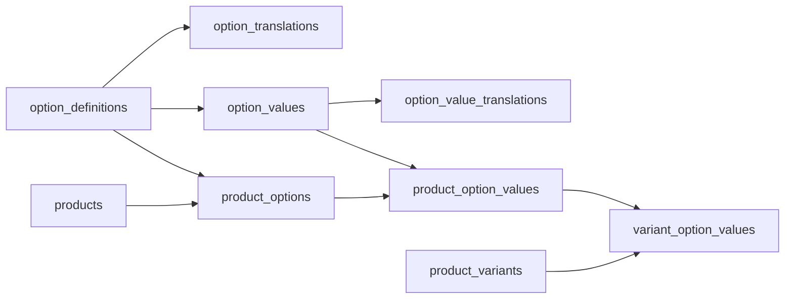

# Reusable Options Refactor

## Proposed Model

Introduce global option definitions and values, while preserving product-scoped assignments for allowed values:



Core intent:
- `[packages/database/src/schema/01-catalog.ts](packages/database/src/schema/01-catalog.ts)` adds reusable option definition tables, likely named `option_definitions`, `option_definition_translations`, `option_values`, and `option_value_translations`.
- Existing `[packages/database/src/schema/01-catalog.ts](packages/database/src/schema/01-catalog.ts)` `product_options` becomes a join from product to reusable option, with `rank` and `unique(product_id, option_id)`.
- Existing `product_option_values` becomes a join from product option assignment to reusable option value, with `rank` and `unique(product_option_id, option_value_id)`.
- `variant_option_values.value_id` continues to point at product-scoped allowed values, so a variant can only select values enabled for that product.
- Localization moves to the reusable definition/value translation tables. First pass should not add product-specific translation overrides unless you explicitly want per-product wording later.

## API And Type Changes

Update `[packages/types/src/admin/product.ts](packages/types/src/admin/product.ts)` so option inputs can either reuse existing records or create new definitions/values:

```ts
// shape, not exact final code
{
  optionId?: string;
  code?: string;
  translations?: [{ languageCode, name }];
  values: [{ valueId?: string; code?: string; translations?: [{ languageCode, label }] }];
}
```

Implementation work:
- Add response fields for reusable IDs: product option assignment id, definition id, product value assignment id, value id, translations.
- Update `[apps/api/src/products/service.ts](apps/api/src/products/service.ts)` create/generate flows to resolve-or-create option definitions and option values inside a transaction.
- Change duplicate checks from “duplicate option names in this submission” to “duplicate option definition assigned to this product” and “duplicate value assigned to this product option”.
- Keep `generateVariants` idempotent by computing combinations from product-scoped `product_option_values.id` records.
- Add a small helper layer in the service, for example `resolveOptionDefinition`, `resolveOptionValue`, and `syncProductOptions`, so create and regenerate do not duplicate the same insertion logic.

## Admin UI Changes

Update `[apps/admin/src/features/products/components/OptionsCard.tsx](apps/admin/src/features/products/components/OptionsCard.tsx)` from free-text-only option creation to reuse-aware editing:
- Load/search reusable options and their localized values from new API endpoints, or a compact options catalog endpoint.
- Let users choose an existing option such as `Color`, select some existing values such as `Red` and `Blue`, and add new values such as `Green` inline.
- Continue showing the local product assignment list and variant count preview before generation.
- Preserve the destructive regenerate confirmation when removing options/values from a product with existing variants.

The minimum API surface I would plan:
- `GET /api/product-options?search=&languageCode=` for reusable option definitions with values.
- `POST /api/product-options` to create an option definition with translations and initial values, or let `generateVariants` create inline definitions if absent.
- Optional later: endpoints to edit global option/value translations outside the product form.

## Destructive DB Reset And Test Data

Because the user explicitly called this destructive, do it only after code review/acceptance:
- Generate migration SQL with `pnpm --filter @repo/database db:generate`.
- Apply with either `pnpm db:push` for local reset-style development or `pnpm --filter @repo/database db:migrate` if keeping generated migrations as the source of truth.
- Clear catalog data using SQL in dependency order: variant option values, variant media/product media, product variants, product option values, product options, product translations, product categories, products, and orphan price/inventory rows as needed. Keep auth/languages/tax classes unless the reset script intentionally reseeds them.
- Run `pnpm db:seed` for language/admin baseline.
- Add a dedicated dev seed script, for example `[packages/database/src/seed-products.ts](packages/database/src/seed-products.ts)`, that creates 10 products:
  - 4 simple products with default variants and EUR prices.
  - 3 variable products using shared `Color` with overlapping subsets like Red/Blue/Green.
  - 2 variable products using shared `Size` with subsets like S/M/L/XL.
  - 1 variable product combining shared `Color` and `Size` to exercise Cartesian generation.
  - Include at least `en` translations for every product, option, and value; optionally add a second language if a non-English language already exists or is added in seed.

## Tests And Verification

Update focused coverage:
- `[apps/api/src/products/__tests__/service.test.ts](apps/api/src/products/__tests__/service.test.ts)` for reusing an option, reusing a subset of values, adding new values to an existing reusable option, localization rows, idempotent variant generation, and destructive regeneration.
- `[apps/admin/src/features/products/__tests__/OptionsCard.test.tsx](apps/admin/src/features/products/__tests__/OptionsCard.test.tsx)` for selecting existing options/values and submitting mixed reused/new values.
- `[apps/admin/src/features/products/__tests__/variant-generator.test.ts](apps/admin/src/features/products/__tests__/variant-generator.test.ts)` only if local UI shape changes affect variant count logic.
- Run `pnpm type-check`, product API tests, and relevant admin product tests after implementation.

## Important Risks

- Existing local products/options can be dropped for this refactor per requirement, so no backwards-compatible data migration is needed for product option records.
- Orders or carts referencing product variants could block hard deletes in a non-empty environment. The reset SQL should either target a disposable local DB or include dependent commerce tables if needed.
- Naming matters: if the existing `product_option_*` names are reused for assignment tables, API response names should be explicit enough to avoid mixing reusable IDs with product assignment IDs.