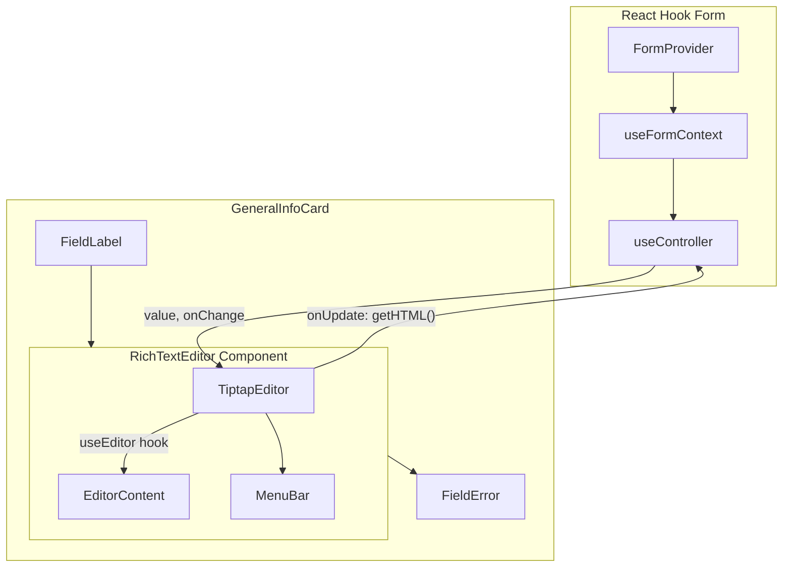

# Rich Text Editor for Product Description

## Decision: Tiptap

After evaluating the three leading options -- Tiptap, Lexical, and Plate -- **Tiptap** is the best fit for this project:

- **Tiptap** (ProseMirror-based): Best DX, 50+ extensions, excellent TypeScript support, clean React Hook Form integration via `useController`, outputs HTML which matches the existing `text` column in the database. Most popular React RTE with ~1.2M weekly downloads.
- **Plate** (Slate-based): Would be a strong choice if the project used shadcn/ui's Form component (`FormField`/`FormControl`), but this project uses a custom `Field`/`FieldLabel`/`FieldError` component system (not shadcn Form). Plate also stores data as a JSON AST (not HTML), which would require a database schema change.
- **Lexical** (Meta): Smaller bundle but steeper learning curve, fewer ready-made features, more DIY for toolbars/menus.

**Why Tiptap wins here:**
- The database stores `description` as a `text` column ([`packages/database/src/schema/01-catalog.ts`](packages/database/src/schema/01-catalog.ts) line 144) -- Tiptap's `getHTML()` output maps directly to this with zero schema changes.
- The project uses plain `useFormContext` / `register` (not shadcn Form) -- Tiptap's `useController` pattern fits cleanly.
- The Zod schema already has `description: z.string().optional()` -- HTML strings pass through without changes.
- Mature extension ecosystem covers all future needs (tables, images, mentions, slash commands).

## Current State

The description field is currently a plain `<Textarea>` in [`GeneralInfoCard.tsx`](apps/admin/src/features/products/components/GeneralInfoCard.tsx) (line 76-81), registered directly via `{...register('description')}`. The form uses `FormProvider` + `useFormContext` from React Hook Form with Zod validation.

## Architecture



## Implementation Plan

### 1. Install Tiptap dependencies

```bash
pnpm add @tiptap/react @tiptap/core @tiptap/starter-kit @tiptap/extension-placeholder --filter @app/admin
```

`@tiptap/starter-kit` bundles: Bold, Italic, Strike, Code, Heading, Blockquote, BulletList, OrderedList, ListItem, CodeBlock, HardBreak, HorizontalRule, History (undo/redo).

### 2. Create `RichTextEditor` component

New file: `apps/admin/src/components/ui/rich-text-editor.tsx`

A reusable, form-agnostic component that accepts `value` (HTML string) and `onChange` callback:

```typescript
interface RichTextEditorProps {
  value?: string;
  onChange?: (html: string) => void;
  placeholder?: string;
  className?: string;
}
```

Key implementation details:
- Use `useEditor` with `StarterKit` + `Placeholder` extension
- Sync outward via `onUpdate: ({ editor }) => onChange(editor.getHTML())`
- Sync inward via `useEffect` that calls `editor.commands.setContent(value)` only when `value` differs from `editor.getHTML()` (avoids the focus-loss bug documented in Tiptap's GitHub issues)
- Do NOT put `value` in `useEditor`'s deps array (causes editor recreation and focus loss)
- Style the editor area to match the existing `Textarea` component's border/focus ring classes from [`textarea.tsx`](apps/admin/src/components/ui/textarea.tsx)

### 3. Create `MenuBar` sub-component

Inside the same file or a sibling. A simple toolbar with toggle buttons for:
- **Bold** / **Italic** / **Strike** (inline marks)
- **Heading 1-3** (block types)
- **Bullet List** / **Ordered List**
- **Blockquote** / **Code Block**
- **Undo** / **Redo**

Use `useEditorState` for performant active-state tracking (avoids re-rendering the whole component on every transaction). Style buttons using the existing [`Toggle`](apps/admin/src/components/ui/toggle.tsx) / [`ToggleGroup`](apps/admin/src/components/ui/toggle-group.tsx) components and Tabler icons (already in the project).

### 4. Add editor prose styles

Add a small CSS file (`apps/admin/src/components/ui/rich-text-editor.css`) or use Tailwind's `prose` classes via `@tailwindcss/typography` plugin to style the rendered HTML inside the editor (headings, lists, blockquotes, code blocks). This ensures the editing experience looks correct.

Install: `pnpm add @tailwindcss/typography --filter @app/admin` (dev dependency).

### 5. Update `GeneralInfoCard` to use `RichTextEditor`

In [`GeneralInfoCard.tsx`](apps/admin/src/features/products/components/GeneralInfoCard.tsx):

- Replace `register('description')` with `useController({ name: 'description', control })` (need to get `control` from `useFormContext`)
- Replace `<Textarea>` with `<RichTextEditor value={field.value} onChange={field.onChange} placeholder="Product description..." />`
- Keep the existing `<FieldError>` for validation errors

### 6. No schema changes needed

- **Zod schema** ([`schema.ts`](apps/admin/src/features/products/schema.ts)): `description: z.string().optional()` already accepts HTML strings
- **Database**: `text('description')` column in `product_translations` already stores arbitrary text
- **API DTOs** ([`product.ts`](packages/types/src/admin/product.ts)): `description: z.string().optional()` -- no changes

### 7. Tests

**Unit tests** (`apps/admin/src/components/ui/__tests__/rich-text-editor.test.tsx`):
- Renders without crashing
- Calls `onChange` with HTML when content changes
- Initializes with provided `value` prop
- Syncs when `value` prop changes externally (form reset scenario)

**Schema test update** ([`schema.test.ts`](apps/admin/src/features/products/__tests__/schema.test.ts)):
- Add a test case that validates an HTML string as description: `description: '<p>A <strong>rich</strong> description</p>'`

Note: The existing vitest config uses `environment: 'node'` and tests are logic-only. For component tests involving Tiptap (which needs DOM), the test environment would need `jsdom`. The RichTextEditor tests should either:
- (a) Set `// @vitest-environment jsdom` per-file, or
- (b) Update vitest config to use `jsdom` for `.tsx` test files

This requires adding `@testing-library/react` and `@testing-library/jest-dom` as dev dependencies.

### 8. Self-checks

- [ ] Editor renders in both create and edit modes
- [ ] Typing produces HTML that reaches the form state (`form.getValues('description')`)
- [ ] Editing an existing product loads the saved HTML into the editor
- [ ] Form reset (navigating away and back) resets editor content
- [ ] Toolbar buttons toggle formatting correctly
- [ ] Editor styling (borders, focus ring) matches other form fields
- [ ] Form submission sends HTML string to the API
- [ ] Empty editor submits as `undefined` or empty string (matching schema)
- [ ] All existing tests still pass
- [ ] New tests pass
