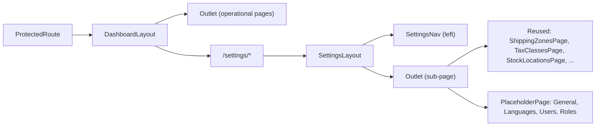

# Settings section reorganization

## Goal

Move configuration-style items out of the main sidebar into a single `Settings` page with its own left sub-nav and nested routes. All moved pages keep their current behavior - we only change where they live in the route tree and which sidebar links to them.

## Scope

- One new layout component (`SettingsLayout`) - the only new component.
- One new placeholder route for `Settings > Store > General` using the existing `[PlaceholderPage](apps/admin/src/components/placeholder-page.tsx)`.
- All other settings sub-pages reuse existing components verbatim (no new feature components, no new grids).
- Update internal links/`navigate(...)` strings in 8 files so the moved features round-trip through their new URLs.
- No backend changes. No redirects. No changes to `SiteHeader`.

## New nav structure

Top-level sidebar in `[apps/admin/src/layouts/DashboardLayout/components/app-sidebar.tsx](apps/admin/src/layouts/DashboardLayout/components/app-sidebar.tsx)`:

- Dashboard
- Catalog: Products, Categories
- Content: Media
- Sales: Orders, Customers
- Inventory: Inventory (Stock locations moves to Settings)
- Marketing: Promotions, Price lists
- Fulfillment: Fulfillments, Returns
- (`Configuration` and `Shipping` groups removed)

`navSecondary`: wire the existing `Settings` placeholder (currently `url: "#"`) to `/settings`.

Inside `SettingsLayout`, the sub-nav is grouped:

- **Store** - General (new placeholder)
- **Regions & taxes** - Languages, Tax classes
- **Shipping** - Shipping zones, Shipping options
- **Locations** - Stock locations
- **Team & access** - Users, Roles

## Route tree

Add nested under the existing `<Route element={<DashboardLayout />}>` block in `[apps/admin/src/App.tsx](apps/admin/src/App.tsx)`:

```tsx
<Route path="/settings" element={<SettingsLayout />}>
  <Route index element={<Navigate to="/settings/store/general" replace />} />
  <Route path="store/general" element={<PlaceholderPage title="General" />} />
  <Route path="regions/languages" element={<LanguagesPage />} />
  <Route path="regions/tax-classes" element={<TaxClassesPage />} />
  <Route path="regions/tax-classes/new" element={<TaxClassCreatePage />} />
  <Route path="regions/tax-classes/:id" element={<TaxClassEditPage />} />
  <Route path="shipping/zones" element={<ShippingZonesPage />} />
  <Route path="shipping/zones/new" element={<ShippingZoneCreatePage />} />
  <Route path="shipping/zones/:id" element={<ShippingZoneEditPage />} />
  <Route path="shipping/options" element={<ShippingOptionsPage />} />
  <Route path="shipping/options/new" element={<ShippingOptionCreatePage />} />
  <Route path="shipping/options/:id" element={<ShippingOptionEditPage />} />
  <Route path="locations" element={<StockLocationsPage />} />
  <Route path="locations/new" element={<StockLocationCreatePage />} />
  <Route path="locations/:id" element={<StockLocationEditPage />} />
  <Route path="team/users" element={<UsersPage />} />
  <Route path="team/roles" element={<RolesPage />} />
</Route>
```

Remove the old top-level routes for `/shipping-zones`, `/shipping-options`, `/tax-classes`, `/languages`, `/stock-locations`, `/users`, `/roles` (lines 69-77 and 91-114 in `App.tsx`).

## SettingsLayout

New file: `apps/admin/src/layouts/SettingsLayout/index.tsx`. Two responsibilities:

1. Render the sub-nav (sectioned vertical menu) with active-state highlighting using `useLocation` (same active-detection pattern as `[nav-group.tsx](apps/admin/src/layouts/DashboardLayout/components/nav-group.tsx)` lines 25-31).
2. Render `<Outlet />` for the current sub-page.

Layout shape (Tailwind, matching the rest of the app):

```tsx
<div className="flex flex-1">
  <aside className="w-60 shrink-0 border-r p-4">
    <SettingsNav />
  </aside>
  <div className="flex-1"><Outlet /></div>
</div>
```

`SettingsNav` is a small component in the same folder (or inlined) that maps a `sections` array (label + items) to `<Link>` elements. No new shadcn primitives needed; reuse `Link` and existing utility classes.

## Internal navigation updates

Update hardcoded path strings to point to the new locations. Each file gets simple find/replace:

- `[apps/admin/src/pages/shipping-zones/ShippingZonesPage.tsx](apps/admin/src/pages/shipping-zones/ShippingZonesPage.tsx)` lines 27, 45 - `/shipping-zones` -> `/settings/shipping/zones`.
- `[apps/admin/src/pages/shipping-options/ShippingOptionsPage.tsx](apps/admin/src/pages/shipping-options/ShippingOptionsPage.tsx)` lines 27, 45 - `/shipping-options` -> `/settings/shipping/options`.
- `[apps/admin/src/pages/tax-classes/TaxClassesPage.tsx](apps/admin/src/pages/tax-classes/TaxClassesPage.tsx)` lines 26, 82 - `/tax-classes` -> `/settings/regions/tax-classes`.
- `[apps/admin/src/pages/stock-locations/StockLocationsPage.tsx](apps/admin/src/pages/stock-locations/StockLocationsPage.tsx)` lines 26, 82 - `/stock-locations` -> `/settings/locations`.
- `[apps/admin/src/features/shipping/components/ShippingZoneForm.tsx](apps/admin/src/features/shipping/components/ShippingZoneForm.tsx)` line 98 - `onBack` target.
- `[apps/admin/src/features/shipping/components/ShippingOptionForm.tsx](apps/admin/src/features/shipping/components/ShippingOptionForm.tsx)` line 217 - `onBack` target.
- `[apps/admin/src/features/shipping/hooks/index.ts](apps/admin/src/features/shipping/hooks/index.ts)` lines 109, 151, 170, 211 - post-mutation `navigate(...)` calls.
- `[apps/admin/src/features/tax-classes/hooks/index.ts](apps/admin/src/features/tax-classes/hooks/index.ts)` lines 85, 180.
- `[apps/admin/src/features/tax-classes/hooks/useTaxClassForm.ts](apps/admin/src/features/tax-classes/hooks/useTaxClassForm.ts)` line 61.
- `[apps/admin/src/features/stock-locations/hooks/index.ts](apps/admin/src/features/stock-locations/hooks/index.ts)` lines 57, 94.
- `[apps/admin/src/features/stock-locations/hooks/useStockLocationForm.ts](apps/admin/src/features/stock-locations/hooks/useStockLocationForm.ts)` line 49.

## Render hierarchy after change



The main `DashboardLayout` sidebar stays visible while in Settings - the new sub-nav is an inner column rendered next to the page content.

## Out of scope (called out explicitly)

- No redirects from old paths to new paths. The admin is private; we'll just remove the old routes. If wanted later, add `<Route path="/shipping-zones" element={<Navigate to="/settings/shipping/zones" replace />} />` etc.
- `SiteHeader` currently shows a static `Documents` title (`[site-header.tsx](apps/admin/src/layouts/DashboardLayout/components/site-header.tsx)` line 14) - pre-existing, unchanged.
- No extraction of route constants to `routes.ts`. Sensible follow-up after the move stabilizes.
- "Inventory" remains its own one-item group in the main sidebar; can be merged into another group later if desired.

## Verification

- Manual click-through: every previously working item still reachable via `/settings/...` and the sub-nav highlights the active section.
- Tests are unaffected: existing test mocks reference module paths (`@/features/.../hooks`), not URL paths.
- Build (`pnpm --filter admin build` or equivalent) and existing test suite should pass without modification.