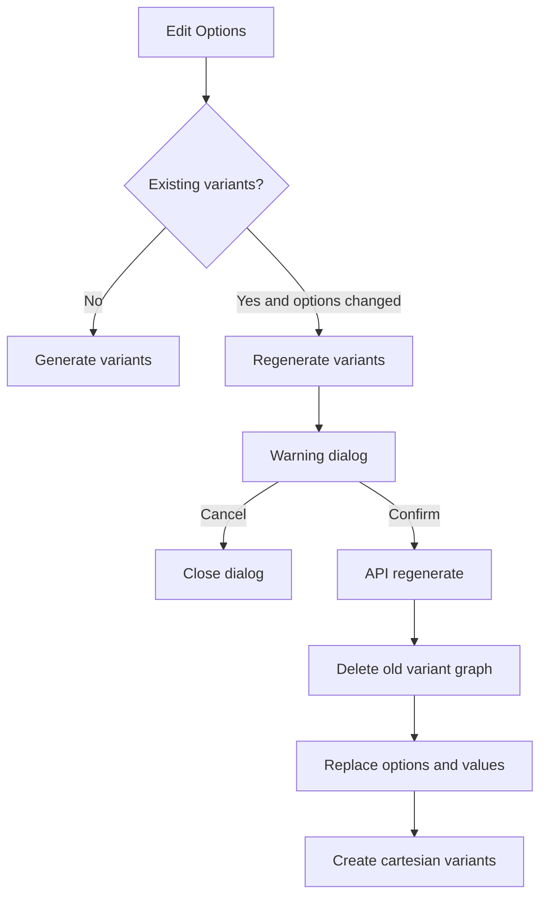

# Variant Regeneration Plan

## Runtime Flow
- Update [`packages/types/src/admin/product.ts`](packages/types/src/admin/product.ts) so `generateVariantsBody` accepts submitted `options` plus a `regenerate?: boolean` flag.
- Keep the existing first-run behavior: when no variants exist, the Options card shows `Generate variants` and submits the local options.
- Add regeneration behavior: when existing generated variants/options exist and local options differ from the persisted product options, show `Regenerate variants`; confirming sends `regenerate: true` with the full current option list.

## Admin UI
- Update [`apps/admin/src/features/products/components/OptionsCard.tsx`](apps/admin/src/features/products/components/OptionsCard.tsx):
  - Track local options against `product.options` to determine `hasOptionChanges`.
  - Show `Generate variants` for first-time generation and `Regenerate variants` after existing variants/options have changed.
  - Add a confirmation `AlertDialog` for regeneration only, warning that existing variants will be recreated.
  - Disable deleting the last option, and keep generation disabled until every option has a non-empty unique name and at least one value.
  - Prevent duplicate option names case-insensitively, e.g. `Color` and `color` are invalid.
  - Continue sending normalized option payloads from local state.
- Keep [`apps/admin/src/features/products/hooks.ts`](apps/admin/src/features/products/hooks.ts) mostly intact, but adjust the toast wording so regeneration can report recreated variants cleanly if the API response needs a richer shape.

## API Behavior
- Update [`apps/api/src/products/service.ts`](apps/api/src/products/service.ts):
  - Validate submitted option names for uniqueness and non-empty values at the service boundary, mirroring UI constraints.
  - For `regenerate: true`, run a single transaction that:
    - Loads current product variants with their `priceSetId` and `inventoryItemId`.
    - Deletes old variant rows and junction rows.
    - Deletes old option rows so option/value translation rows cascade.
    - Deletes old price sets so price rows cascade.
    - Deletes old inventory items when no restrictive inventory history blocks removal.
    - Inserts the submitted options and values.
    - Generates the new cartesian product from the freshly inserted option values.
  - For first generation with no stored options, keep the current insert-options-then-generate path.
  - Return a clear `{ created }` count, or a richer `{ created, regenerated }` response if needed by UI copy.
- Update [`apps/api/src/products/controller.ts`](apps/api/src/products/controller.ts) only if API errors need friendly handling for invalid duplicate option names or blocked cleanup.

## Tests
- Extend [`apps/api/src/products/__tests__/service.test.ts`](apps/api/src/products/__tests__/service.test.ts):
  - First generate from submitted local options persists options and variants.
  - Regenerate after adding an option replaces old options/variant combinations and leaves no old variant-option rows.
  - Regenerate after deleting an option replaces combinations accordingly.
  - Duplicate option names are rejected.
- Add or extend admin tests near [`apps/admin/src/features/products/__tests__/ProductForm.test.tsx`](apps/admin/src/features/products/__tests__/ProductForm.test.tsx), likely with a dedicated `OptionsCard` test file:
  - Shows `Generate variants` on first generation.
  - Shows `Regenerate variants` after editing existing options.
  - Cancel closes the warning without calling the mutation.
  - Confirm calls mutation with `regenerate: true` and current options.
  - Last option cannot be deleted.
  - Duplicate option names disable generation/regeneration and surface validation text.

## Verification
- Run focused API product service tests and admin product component tests.
- Run `pnpm --filter @repo/types type-check` and `pnpm --filter @app/admin type-check`.
- Run `pnpm --filter @app/api type-check`; note that it may still report the unrelated pre-existing `src/lib/requestLogger.ts` `customerId` issue unless that is fixed separately.